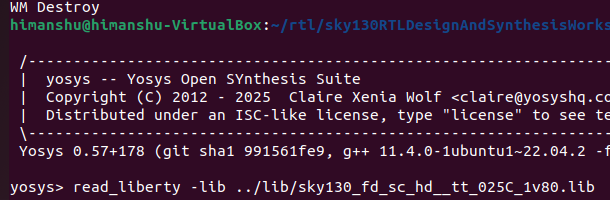

# WEEK 0
## Objective
To download and setup yosys,magic,iverilog,gtkwave.
## 🖥 RISC-V Reference SoC Tapeout Program VSD


<div align="center">

> "In this program, we learn to design a System-on-Chip (SoC) from basic RTL to GDSII using open-source tools. Part of India's largest collaborative RISC-V tapeout initiative, empowering 3500+ participants to build silicon and advance the nation's semiconductor ecosystem."

</div>

<div align="center">

 </div>

---

## 🎯 Program Objectives & Scope

| Aspect                 | Details                                                                |
| ---------------------- | --------------------------------------------------------------------   |
| 🎓 *Learning Path* | Complete SoC Design: RTL → Synthesis → Physical Design → Tapeout      |
| 🛠 *Tools Focus* | Open-Source EDA Ecosystem (Yosys, OpenLane, Magic, etc.)                  |
| 🏭 *Industry Relevance* | Real-world semiconductor design methodologies                      |
| 🤝 *Collaboration* | Part of India's largest RISC-V tapeout initiative                       |
| 📈 *Scale* | 3500+ participants contributing to silicon advancement                          |
| 🇮🇳 *National Impact* | Advancing India's semiconductor ecosystem                             |


## Table of Contents

| Week  | Tools / Sections |
|-------|-----------------|
| 0     | - [Yosys]<br>- [Icarus Verilog]<br>- [GTKWave]<br>- [ngspice]<br>- [Magic]<br>- [Docker]<br>- [OpenLane] |

### ** System Prerequisites**

-   *System Requirements: 4 vCPU, 6 GB RAM, 50 GB HDD, **Ubuntu 20.04* or higher.
-   
### Yosys
Yosys is an open-source framework for Verilog RTL synthesis. It's used to convert the human-readable HDL (Verilog) into a gate-level netlist.

```bash
sudo apt-get update
git clone https://github.com/YosysHQ/yosys.git
cd yosys
sudo apt install make
sudo apt-get update
sudo apt-get install -y build-essential clang bison flex libreadline-dev gawk tcl-dev libffi-dev git graphviz xdot pkg-config python3 libboost-system-dev libboost-python-dev libboost-filesystem-dev zlib1g-dev
git submodule update --init --recursive
make config-gcc
make
sudo make install 
```



### Icarus Verilog
Icarus Verilog is a compiler and simulator for the Verilog language.

```bash
sudo apt-get update
sudo apt-get install iverilog
```

### GTKWave
GTKWave is a digital waveform viewer used to analyze the simulation results generated by tools like Icarus Verilog.

```bash
sudo apt-get update 
sudo apt install gtkwave
```

### ngspice
ngspice is an open-source mixed-level/mixed-signal circuit simulator. It's essential for analyzing the analog behavior of circuits.

Download from [https://sourceforge.net/projects/ngspice/files/](https://sourceforge.net/projects/ngspice/files/)

```bash
tar -zxvf ngspice-37.tar.gz
cd ngspice-37
mkdir release
cd release
../configure --with-x --with-readline=yes --disable-debug
make
sudo make install
```
### Magic
Magic is a vunerable VLSI layout editor. It's used for creating and modifying the physical layout of integrated circuits, which is the final step before fabrication.

```bash
sudo apt-get install m4 tcsh csh libx11-dev tcl-dev tk-dev libcairo2-dev mesa-common-dev libglu1-mesa-dev libncurses-dev
git clone https://github.com/RTimothyEdwards/magic
cd magic
./configure
make
sudo make install
```

### Docker
Docker is a platform that uses OS-level virtualization to deliver software in packages called containers. It is a prerequisite for running the OpenLane flow, as it ensures a consistent and reproducible environment for all the tools.

```bash
sudo apt-get update
sudo apt-get upgrade
sudo apt install -y build-essential python3 python3-venv python3-pip make git
sudo apt install apt-transport-https ca-certificates curl software-properties-common
curl -fsSL https://download.docker.com/linux/ubuntu/gpg | sudo gpg --dearmor -o /usr/share/keyrings/docker-archive-keyring.gpg
echo "deb [arch=amd64 signed-by=/usr/share/keyrings/docker-archive-keyring.gpg] https://download.docker.com/linux/ubuntu $(lsb_release -cs) stable" | sudo tee /etc/apt/sources.list.d/docker.list > /dev/null
sudo apt update
sudo apt install docker-ce docker-ce-cli containerd.io
sudo docker run hello-world
sudo groupadd docker
sudo usermod -aG docker $USER
sudo reboot

# After reboot
docker run hello-world
```
### Error in using docker
- Docker DNS error
  ```bash
  docker: error pulling image configuration: download failed after attempts=6: dial tcp: lookup ... on 127.0.0.53:53: server misbehaving
  ```
  Docker cannot resolve the registry host because your system’s DNS (name resolution) is failing.
  #### STEP 1
  edit this file
  ```bash
  sudo nano /etc/systemd/resolved.conf
  ```
  In resolved.conf uncomment and change below lines
  ```bash
  DNS=8.8.8.8 1.1.1.1
  FallbackDNS=8.8.4.4 1.0.0.1
  DNSStubListener=no
  ```
  Save & exit (CTRL+O, Enter, CTRL+X).
  #### STEP 2
  Restart sytemd
  ```bash
  sudo systemctl restart systemd-resolved
  ```
  #### STEP 3
  ```bash
  sudo mv /etc/resolv.conf /etc/resolv.conf.backup
  sudo ln -s /run/systemd/resolve/resolv.conf /etc/resolv.conf
  ```
  #### STEP 4
  Restart docker
  ```bash
  sudo systemctl restart docker
  ```
 Check below commands
```bash
sudo docker run busybox nslookup google.com
```
```bash
sudo docker run hello-world
```

### OpenLane
OpenLane is an automated RTL-to-GDSII flow that integrates a suite of open-source tools to take a design from a hardware description to a final physical layout file. Note: Docker must be installed and configured before proceeding.

```bash
cd $HOME
git clone https://github.com/The-OpenROAD-Project/OpenLane
cd OpenLane
make
make test
```
and reproducible design flows.
-   Configured a virtual machine (or WSL) with optimal specifications for EDA workloads.
