# WEEK 1
[](https://riscv.org/)
[](https://vsdiat.vlsisystemdesign.com/)


## OBJECTIIVE
- To Yosys tool to generate netlist for various design
- To optimize design 
- To use iverilog and Gtkwave.
### Day 1
**Yosys**
- A RTL to netlist converter. It requires design file and standard library file.
- For verification of netlist level design given by yosys use iverilog and gtkwave and use same testbench file as used before.
- **.lib** file consists of all standard cell used to generate netlist. It contains cell of different speed. Use fast cells for less delay 
           but chances of hold violation increases , Use slow cells for no hold violation but chnaces of setup violation iincreases tradeoff fast cell and slow cell(medium).
**Iverilog**
Icarus Verilog (iverilog) is an open-source Verilog simulator. It compiles Verilog source code into an executable simulation.
Combined with GTKWave, it provides visibility into signal waveforms.

Workflow:
-Write RTL and testbench.
-Compile with iverilog.
-Run the output executable.
-Open .vcd dump in GTKWave.

This ensures functional correctness of the RTL before synthesis.
Below github repo consists of std lib file
```bash
git clone https://github.com/kunalg123/sky130RTLDesignAndSynthesisWorkshop.git
cd sky130RTLDesignAndSynthesisWorkshop/verilog_files/
```
**Compile and verify**
 ```bash
 iverilog good_mux.v tb_good_mux.v
 ./a.out 
 gtkwave tb_good_mux.vcd
 ```

## Yosys
- Workflow:
    -Read RTL → ```bash read_verilog your_design.v ```
    -Synthesize Logic → ```bash synth -top <module name> ```
    -Map to Standard Cells → ```bash abc -liberty your_lib.lib```
    -View Design (Optional) → ```bash show ```
    -Export Netlist → write_verilog output.v
- example
 ```bash
  yosys
 ```
 ```bash
  read_liberty -lib ../lib/sky130_fd_sc_hd__tt_025C_1v80.lib
  read_verilog good_mux.v
  synth -top good_mux
  abc -liberty ../lib/sky130_fd_sc_hd__tt_025C_1v80.lib
  show
 ```
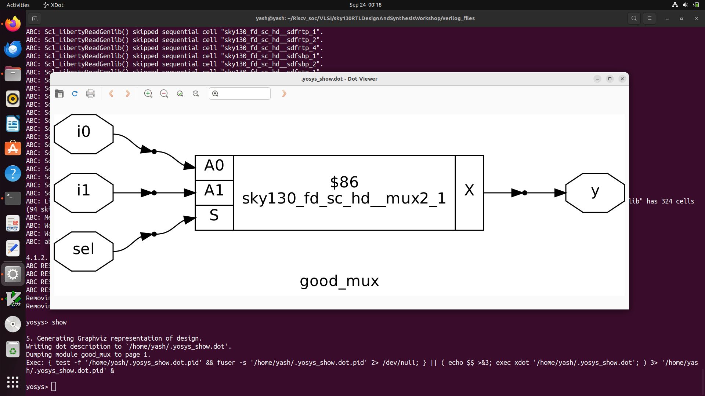 

- For Netlist
```bash
 write_verilog -noattr good_mux_netlist.v
 !vim good_mux_netlist.v
```
- Performed Gate level synthesis using Sky130 PDK standard cells.

### Day - 2 --> Introduction to timing library and syntehsis methododlogy 
In __hierarchical design__, a big system is broken down into smaller sub-systems, arranged like a tree structure (top → middle → bottom)
 -Advantages:
   -Clear organization and modularity
   -Easier maintenance and scaling
   -Reusable sub-modules
   -Parallel team development is possible.
-Disadvantages:
 -More planning required initially
 -Slightly more overhead in connecting modules.
In __flat design__ , the entire system is built in one large block without breaking it into sub-modules. All components are described together.It's used for simple designs.
 -Advantages:
  -Fast to design for small systems
  -No extra module connections.
 -Disadvantages:
  -Hard to debug and modify
  -Not reusable
  -Not scalable for large designs
  -Becomes messy and confusing

### Examples:
- For Hierarchial design.
   - Open Yosys
     ```bash
     yosys
     ```
   - Synthesis
     ```bash
     read_liberty -lib ../lib/sky130_fd_sc_hd__tt_025C_1v80.lib
     read_verilog multiple_modules.v
     synth -top multiple_modules 
     abc -liberty ../lib/sky130_fd_sc_hd__tt_025C_1v80.lib 
     show multiple_modules
     ```
 - __OUTPUT__
   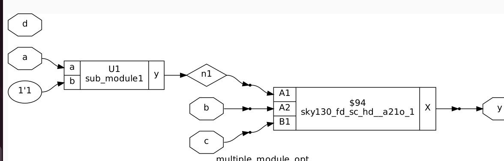

- For Flat design
  - Open Yosys
     ```bash
     yosys
     ```
   - Synthesis
     ```bash
     read_liberty -lib ../lib/sky130_fd_sc_hd__tt_025C_1v80.lib
     read_verilog multiple_modules.v
     synth -top multiple_modules 
     abc -liberty ../lib/sky130_fd_sc_hd__tt_025C_1v80.lib
     flatten
     show multiple_modules
     ```
 - __OUTPUT__
   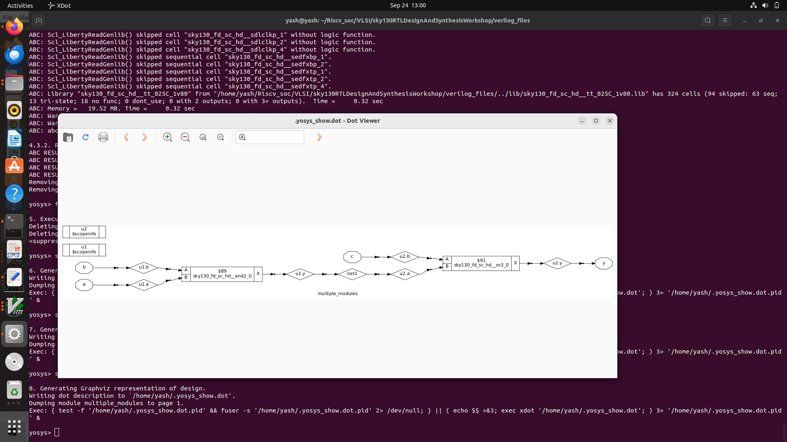

## Synchronous and Asynchronous flip flops

-A __synchronous__ flip-flop changes its output only when a clock pulse arrives.
-Clock signal controls when the flip-flop updates.
-All flip-flops are triggered together using the same clock.
-Inputs like __SET__ and __RESET__ also work only at the clock edge.
 -__Iverilog and gtkwave__
  ```bash
  iverilog dff_syncres.v tb_dff_syncres.v 
  ./a.out
  gtkwave tb_dff_syncres.vcd
 ```
- __Synthesis__
  ```bash
  read_liberty -lib ../lib/sky130_fd_sc_hd__tt_025C_1v80.lib
  read_verilog dff_syncres.v
  synth -top dff_syncres
  dfflibmap -liberty ../lib/sky130_fd_sc_hd__tt_025C_1v80.lib
  abc -liberty ../lib/sky130_fd_sc_hd__tt_025C_1v80.lib 
  show
  ```
- __Output__
  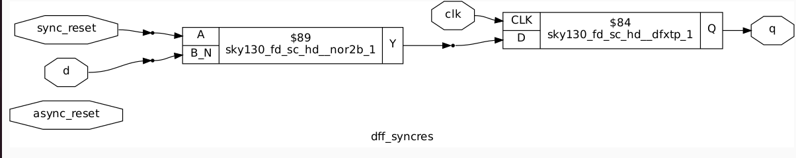

-An __asynchronous__ flip-flop can change its output anytime, independent of the clock, usually through asynchronous SET or RESET pins.
-Special inputs like preset (SET) and clear (RESET) act immediately, not waiting for clock.
-These are often called “direct inputs.”

-__Iverilog and gtkwave__
  ```bash
  iverilog dff_async.v tb_dff_async.v 
  ./a.out
  gtkwave tb_dff_async.vcd
 ```
- __Synthesis__
  ```bash
  read_liberty -lib ../lib/sky130_fd_sc_hd__tt_025C_1v80.lib
  read_verilog dff_async.v
  synth -top dff_async
  dfflibmap -liberty ../lib/sky130_fd_sc_hd__tt_025C_1v80.lib
  abc -liberty ../lib/sky130_fd_sc_hd__tt_025C_1v80.lib 
  show
  ```
- __Output__
  


  ### Day 3 - Combinational and sequential circuit optimization
   - __Logic optimization__ is the process where a synthesis tool automatically transforms a gate-level circuit into a  smaller,faster, and more power-efficient version without changing its logical function. The primary goal is to meet the design constraints for timing (performance), power consumption, and chip area.

   - __Combinational logic__ optimization means reducing the complexity (gates, area, delay, power) of a digital logic circuit without changing its function.
      - __Karnaugh Map (K-map) / Quine–McCluskey Minimization__
      -Tools internally use advanced algorithms (similar to K-map for small circuits) to get minimum SOP (Sum of Products)           or POS (Product of Sums).
      -K-map is practical for up to 4–6 variables.
      -Quine–McCluskey is algorithmic and works for larger functions.
      - __Common Subexpression Elimination__
       -If the same logic expression appears multiple times, tools compute it once and share the result.
       -Example:
       -Y1 = A·B + C
       -Y2 = A·B + D
       -Instead of two A·B blocks → compute A·B once, use for both Y1 and Y2.
     - __Constant Propagation and Folding__
      -If some inputs are fixed (0 or 1), tools substitute constants and simplify.
      -Example:
       -Y = A·0 → Y = 0
       -Z = B + 1 → Z = 1
     - __Unused Logic Elimination__
      -If some part of the circuit does not affect any output, tools remove it.
       -Example:
        -A temporary wire not connected to any output i.e eliminated.
     - __Don’t-Care Condition Exploitation__
      -If some input combinations never occur, tools can treat them as “X” (don’t care) and optimize aggressively.
       Common in FSMs, encoders, decoders.
        Benefit: Reduces number of minterms, simplifies expressions.
    - __Technology Mapping Optimization__
     -After logic simplification, tools map optimized logic to available standard cells or FPGA LUTs.
      They try to pick the smallest and fastest combination of gates for the given function.
    - __MUX (Multiplexer) Optimization__
     -Multiplexer optimization means simplifying or reorganizing large multiplexer structures to reduce area, power, and           delay.
     -This usually happens when the HDL code has nested if-else or case statements.
     - If we have nested if-else statements GLN will use multiple mux for exah if - else statement.

### In yosys optimization
    - Use Command
     ```bash
     opt_clean -purge
     ```
    - __Example__
    -open Yosys
      ```bash
      yosys
      ```
    - Synthesis
      ```bash
      read_liberty -lib ../lib/sky130_fd_sc_hd__tt_025C_1v80.lib
      read_verilog opt_check.v
      synth -top opt_check
      opt_clean -purge
      abc -liberty ../lib/sky130_fd_sc_hd__tt_025C_1v80.lib 
      show
      ```
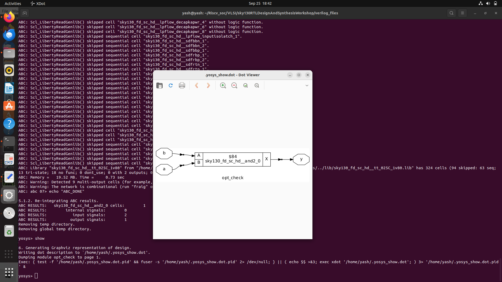

### Sequential Optimization
-__State Reduction__
 -Minimize the number of states in the finite state machine (FSM).
 - As Fewer states will have fewer flip-flops and less logic.
 -Identify equivalent states 
 -Merge them into a single state.
 - Example:
  -If state A and B behave identically, replace both with one state.
-__Retiming__
 -Move flip-flops across combinational logic to improve speed or reduce registers without changing functionality.
 -Balance pipeline stages → shorter critical path → higher clock frequency.
-__Unreachable State Removal__
 -Eliminate states that can never be reached from the initial state.
 - Reduces state table, flip-flops, and next-state logic.
 -Traverse state graph → find unreachable nodes → delete.
-__Clock Gating__
 -In digital circuits, clock keeps toggling continuously, even if the flip-flop doesn’t need to update.
  This wastes dynamic power (because clock switching is a big power consumer).
 -__Clock gating__ means to stop giving clock pulses to parts of the circuit when they’re idle.
  This reduces unnecessary switching activity → saves power.
 -__Dynamic power__,P=a*C*V^2*F
   -α = activity factor (how often signal toggles)
   -C = load capacitance
   -V = supply voltage
   -f = clock frequency
  -If we gate the clock, α ↓ → big power saving.
- __Register merging__ means combining multiple smaller registers into a single larger register, if they have similar control signals (clock, reset, enable).
  -If we have 4, 1bit regs, then we would require independent clock for each reg which increases power consumption and load on clock tree. So we combine and make a 4 bit reg.

- __Register splitting__ means dividing a large register into smaller parts, usually to improve timing or optimize enable conditions.
   -If we have a 10 bit regs and some of its bits doesn't change often so we can split in two parts so we can reduce delay as if bits in one is not changing then it is off.

### Example of d_ff
- Gtkwave
   - ```bash
     iverilog dff_const1.v tb_dff_const1.v
     ./a.out
     gtkwave tb_dff_const1.vcd
     ```
- Yosys
  - ```bash
    read_liberty -lib ../lib/sky130_fd_sc_hd__tt_025C_1v80.lib 
    read_verilog dff_const1.v
    synth -top dff_const1
    dfflibmap -liberty ../lib/sky130_fd_sc_hd__tt_025C_1v80.lib 
    abc -liberty ../lib/sky130_fd_sc_hd__tt_025C_1v80.lib 
    show
    ```
  - Output
    - 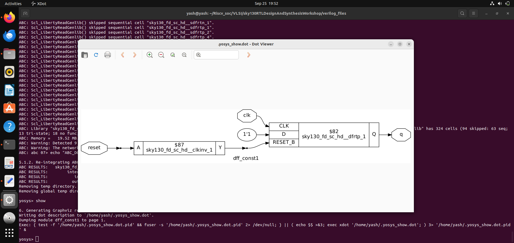

__logic Trimming__ (or Dead Code Elimination): If the output of a flip-flop or a block of logic is not connected to anything else in the design (i.e., it has no fan-out), it serves no purpose. The synthesis tool will identify and completely remove these unused registers and any combinational logic that solely drives them, leading to significant savings in both area and power.
  - Example - Counter
  - Yosys
     - ```bash
       read_liberty -lib ../lib/sky130_fd_sc_hd__tt_025C_1v80.lib
       read_verilog counter_opt.v
       synth -top counter_opt
       dfflibmap -liberty ../lib/sky130_fd_sc_hd__tt_025C_1v80.lib 
       abc -liberty ../lib/sky130_fd_sc_hd__tt_025C_1v80.lib 
       show
       ```
    - Output
      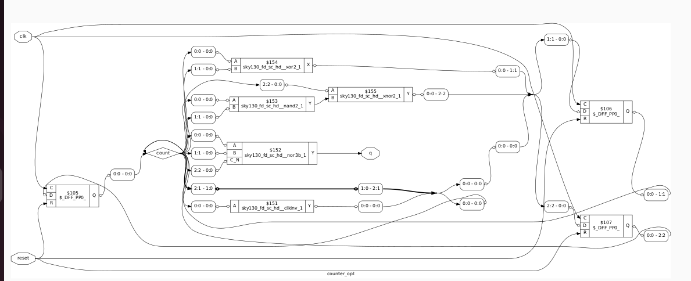

### Blocking vs Non blocking
 - Blocking Assignments (=)
   - A blocking assignment (=) is executed sequentially, just like in a standard programming language. The execution of the       next statement is "blocked" until the current one is complete. The variable on the left-hand side is updated                 immediately.
     
    Best Used For: Combinational logic (always @(*)), where the logic flow is sequential.

-Non-blocking Assignments (<=)
 -A non-blocking assignment (<=) is executed concurrently. The simulator evaluates all the right-hand side expressions first and then, at the end of the time step, assigns those evaluated values to the left-hand side variables.
 
    -Best Used For: Sequential logic (always @(posedge clk)), as it accurately models how flip-flops in hardware all change       state at the same time on a clock edge.
    
__Synthesis-Simulation Mismatch__
-A synthesis-simulation mismatch is a critical design bug where the pre-synthesis RTL simulation behaves differently from the post-synthesis gate-level simulation.
- When you use blocking assignments inside a clocked always block, the execution order inside the block affects results —
but in hardware, all flip-flops update simultaneously on the clock edge.
 - When we use blocking assignment in always clk block in real hardware we will have flip flops that capture value parallely at posedge
-Example blocking cavet
 -Gtkwave
  -```bash
   iverilog blocking_caveat.v tb_blocking_caveat.v
   ./a.out
   gtkwave tb_blocking_caveat.vcd
   ```
 - 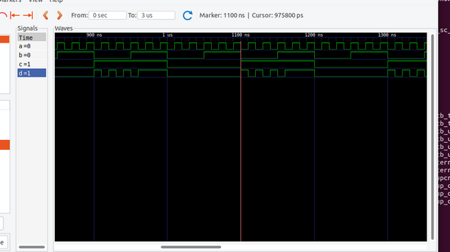
  -Yosys
   -```bash
   read_liberty -lib ../lib/sky130_fd_sc_hd__tt_025C_1v80.lib 
   read_verilog blocking_caveat.v
   synth -top blocking_caveat
   abc -liberty ../lib/sky130_fd_sc_hd__tt_025C_1v80.lib 
   write_verilog -noattr blocking_cavnet_net.v
   show
   ```
  - 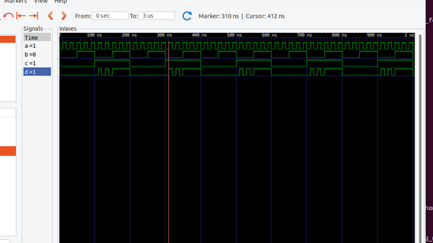

### Optimizing constructs
 -Both if and case statements describe conditional logic, but the synthesis tool can create very different hardware from them.
 -if andelse-if Chain: This construct is synthesized into a priority encoder. Conditions are evaluated in order, meaning the first condition has the highest priority. This can create a long chain of logic that may result in slower timing paths.
- case Statement: This is typically synthesized into a balanced multiplexer (MUX).

__Incomplete Specification and Latches__
A common pitfall is an "incomplete" if or case statement, where a signal is not assigned a value in every possible branch.
 -To ensure the signal retains its value, the synthesis tool must infer memory. This creates an unintended latch.
-  Latches are generally avoided in synchronous designs because they are transparent (not edge-triggered), can be susceptible to glitches, and complicate static timing analysis. Always ensure all paths assign a value to every signal or include a default case
__For vs For generate__
A for loop describes sequential behavior inside an always block. During synthesis, the tool unrolls the loop to create a large, replicated block of combinational logic. It cannot be used to create multiple instances of modules.
-Analogy: One worker performing a series of repetitive tasks. The result is one large piece of work.

-A for generate is a declarative statement used to create multiple instances of hardware. The tool elaborates the loop to create parallel, duplicated structures like modules, registers, or logic blocks. It is ideal for building regular, repetitive hardware like register files or connecting multiple cores.
 -Analogy: Hiring multiple workers to perform the same task in parallel. The result is multiple identical pieces of hardware.
  -Example - RCA
   -gtkwave
    ```bash
    iverilog fa.v rca.v tb_rca.v
    ./a.out
    gtkwave tb_rca.vcd
    ```
    - yosys
    ```bash
    read_liberty -lib ../lib/sky130_fd_sc_hd__tt_025C_1v80.lib
    read_verilog fa.v rca.v
    synth -top rca
    abc -liberty ../lib/sky130_fd_sc_hd__tt_025C_1v80.lib
    write_verilog -noattr rca_net.v
    select -module rca
    show
    ```
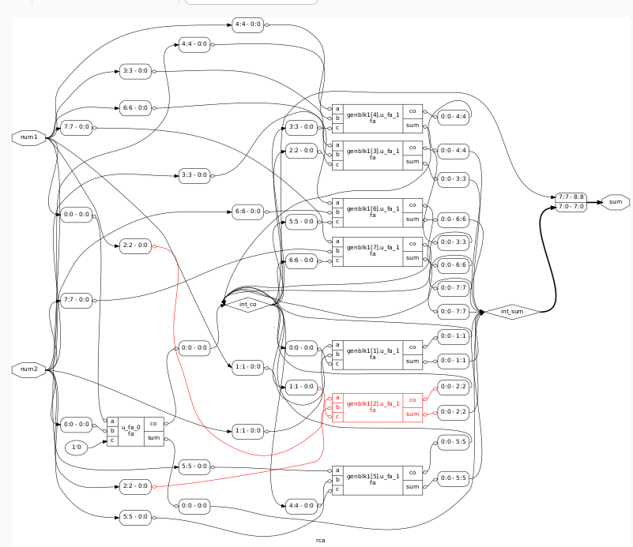

-Example Mux
 -Gtkwave
  - ```bash
    iverilog mux_generate.v tb_mux_generate.v
    ./a.out
    gtkwave tb_mux_generate.vcd
    ```
-Yosys
 - ```bash
   read_liberty -lib ../lib/sky130_fd_sc_hd__tt_025C_1v80.lib 
   read_verilog mux_generate.v
   synth -top mux_generate
   abc -liberty ../lib/sky130_fd_sc_hd__tt_025C_1v80.lib 
   write_verilog -noattr mux_generate_net.v
   show
   ```
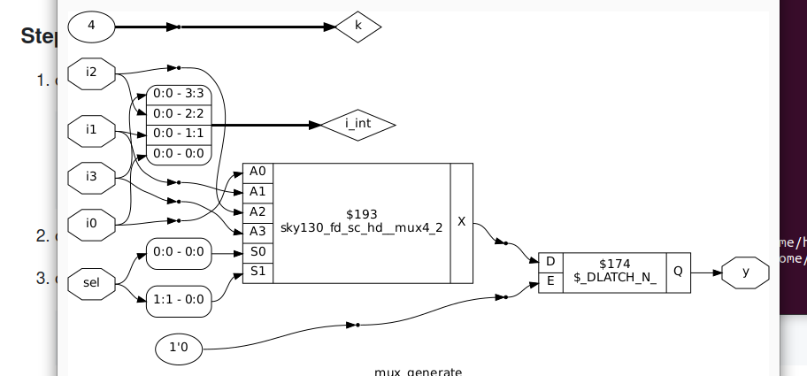
  


Allow partial clock gating.
